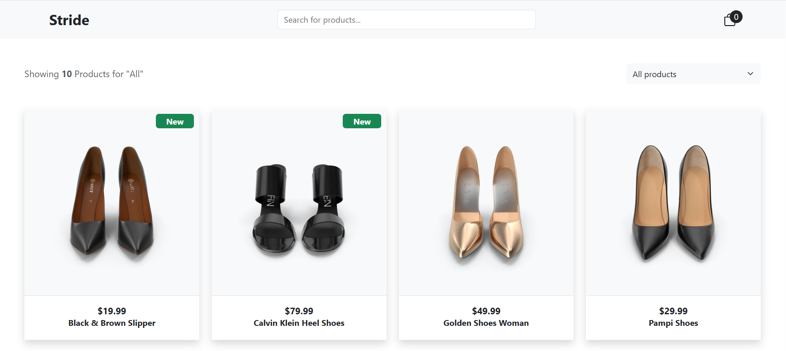

# Shoe Store

<br>
<div align="center">
  <a href="https://shoe-store-ecommerce.netlify.app">
    
      <br><br> 
    
  </a>
</div>

<br>

## Tech Stack

<div>
  
  
  
  
  
</div>

## Key Features

- eCommerce shoe store with dynamic data using API
- Search, sorting, and cart management functionality
- Responsive design optimized for all screen sizes
- Product status indicators for New Arrivals and Sale items

## Getting Started

1. **Clone the repository:**

   ```bash
   git clone https://github.com/MarinaDiana01/shoe-store.git
   cd shoe-store
   ```

2. **Install dependencies:**

    ```bash
   npm install
   ```
3. **Start the development server:**

    ```bash
   npm run dev
   ```

    
